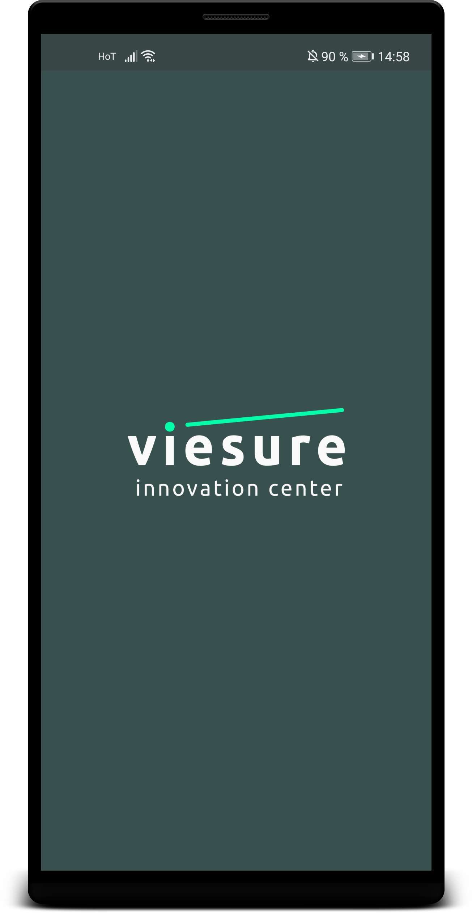
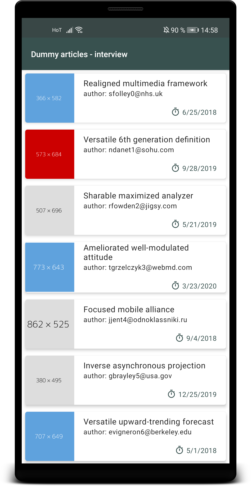

# mobile-qa-interview

## Application overview

| Launcher screen  | Article list | Article Detail Screen |
| ---------------- | ------------ |---------------------- |
|  |  |  |

### Launcher screen: 
A splash screen with Viesure logo that appear while the application is launching.

### Article screen: 
In this screen we,
* fetch a list of dummy articles from `https://run.mocky.io/v3/de42e6d9-2d03-40e2-a426-8953c7c94fb8` with the following data structure:

```json
{
  "id": 1,
  "title": "Realigned multimedia framework",
  "description": "nisl aenean lectus pellentesque eget nunc donec quis orci eget orci vitae mattis nibh ligula",
  "author": "sfolley0@nhs.uk",
  "release_date": "6/25/2018",
  "image": "http://dummyimage.com/366x582.png/5fa2dd/ffffff"
}

```
* Show article's `image`, `title`, `author` and `release_date` in a list.

### Detail screen:
when user select an article -from list mentioned above- we show its information in a separate page. This page contains the following elements:
* An action bar which contains:
  * Title of a given article
  * Back button (redirects user to the previous screen)
  * Send message action menu, which launches the native mail application with author's email address and article's title as subject.
* Article header image
* Article release date
* Article title
* Article description
* Article's author

## About the app
| Platform  | Minimum API version | Application id (bundle id) | Application main (launcher) Activity | Artifact |
| --------- | ------------------- |--------------------------- | ------------------------------------ | -------- |
| Android | [](https://android-arsenal.com/api?level=23) | `io.viesure.qa` | `io.viesure.qa.views.MainActivity` | [download APK](./app/android/qa-interview.apk) |

## Your task
You need to implement a test automation for the application (see above) using Cucumber and Appium through TestNG.
* Define Cucumber scenarios
* Use the following farmeworks/technologies within the automation project:
  * Appium with Selenium Grid.
  * Executed Cucumber in parallel using TestNG and Maven.
  * Allure Framework for reporting.
* Include the final automated test result/report in the readme.
* Open a pull request containing automation source code and an informative readme.

## Next Step
Our mobile development team will review your task carefully and contact you as soon as possible.


